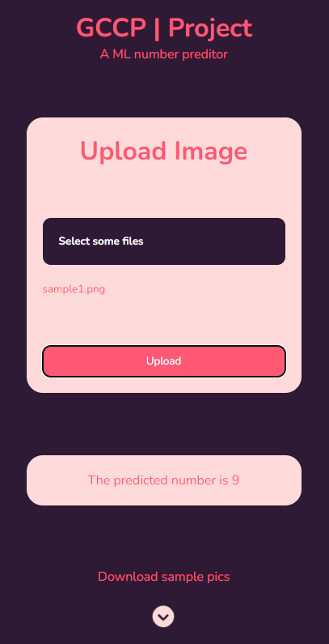

# Handwritten Image Prediction

This repository contains the code for a machine learning model that predicts handwritten images. The model is trained using the MNIST dataset and is deployed on Cloud Run.

## Getting Started

The model is deployed on cloud run. It can be easily accessed from anywhere and through any device.

For the ease of access the model has been made available through a website

> Go to [this](http://35.188.85.94/) link

Now you can see an interface like this 

> You can download some sample images by clicking the download button below `Each time we can download a random picture`

 
After uploading an image you can see the prediction in the website itself

 

## About
----
The main code is written in python.You can find the code [here](https://github.com/jayasankar-shyam/number-predictor/blob/main/main.py)

You can use the model which is deployed on the cloud run by attaching the below link to your code

> https://getprediction-gzrkj7ydfa-uc.a.run.app

 

You can also run and test your code locally by using the [test.py](https://github.com/jayasankar-shyam/number-predictor/blob/main/test/test.py) file

`make sure to run it on the local host before testing`

